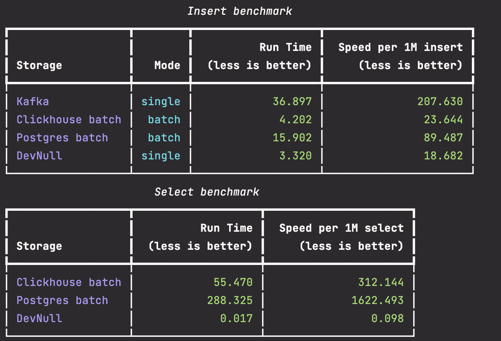

# Исследование хранилищ

## Интерпретация результата - вставка

Для режима вставки если это возможно для хранилища был выбран вариант `batch`, то есть режим пакетной записи.  
Для Kafka режим был взять как single, то есть редим записи кажого события по отдельности, так как события приходят по отдельности для регистрации входящих  сообщений фактически нужно писать каждое событие самостоятельно.

Скорость вставки в Click House 23.6 секунды против 89,4 в Postrees на 1 Млн записей.

Пустое хранилище DevNull показывает накладые расходы python, вычитая DevNull из времени хранилища можно определить именно собственное время работы сервера 

## Интерпретация результата - чтение

Скорость чтения в Click House 312.1 секунды против 1622,5 секунд в Postrees на 1 Млн записей.
