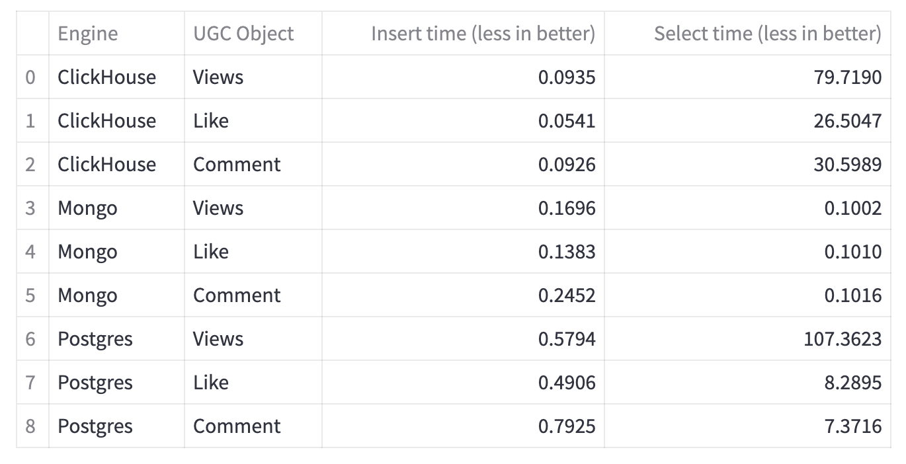

# Исследование хранилищ

Прогон 10 циклов по 3000 объектов, суммарное время.
Чем меньше время - тем лучше результат.

## Расшифровка результатата

Было подготовлено 3 класса UCG данных - с большим количеством данных на объект (комментарии), с малым (лайки) и со средним объемом, но с большим количеством полей (просмотры).
Для каждого хранилища выполнялось N циклов вставки и чтения по M объектов.
Вставка производилась в пакетном режиме, чтение - в последовательном режиме.

## Интерпретация результата - вставка

Лидер по сохранению данных по прежнему Clickhouse.

## Интерпретация результата - чтение

Лидер по чтению неаграгированных данных - MongoDB.

Оставание Postgres было в разы больше, но после введения индексов - подтянулось до разумных величин.

Отставание Clickhouse пока ничем не объяснимо, видимо выбрана неверная структура данных для хранения или неверно настроен кластер. Исследование того как это исправить - отдельная тема, выходит за временные рамки спринта.

## Новый пользовательский интерфейс

## Установка и запуск
 - Все нужные файлы docker  - в папке `docker`
 - Для инициализации clickhouse использовать `setup.py`
 - Для запуска приложения `python -m streamlit run app.py`
 - Приложение доступно `http://localhost:8501`

## История изменений

 - Добавлено Mongo DB.
 - Добавлены несколько классов данных.
 - Полностью переработан пользовательский интерфейс.